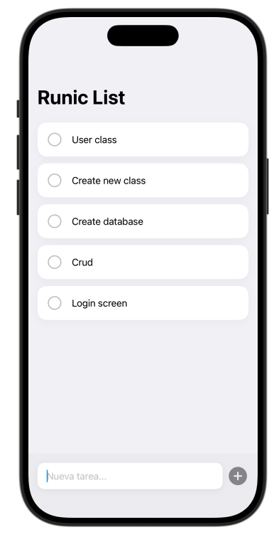
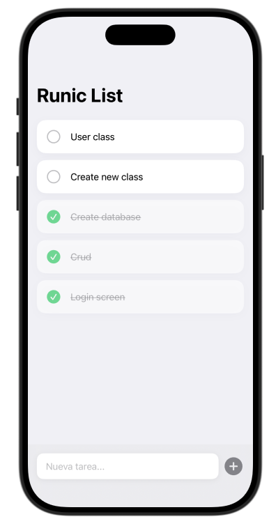
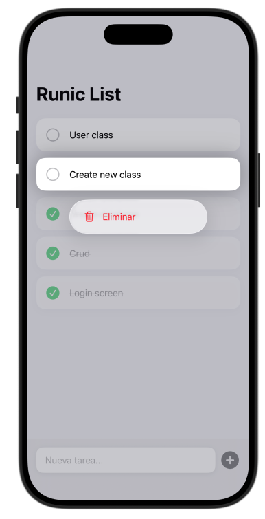

# Runic List 📝

**Runic List** es una aplicación iOS minimalista, elegante y moderna diseñada para la gestión rápida de tareas diarias.

Este proyecto forma parte de mi aprendizaje activo y transición profesional de **Desarrollador Senior en .NET a Desarrollador iOS (Swift/SwiftUI)**.

## 🚀 La Transición: De .NET a iOS

Pasar de un ecosistema maduro como .NET/C# a Swift y SwiftUI ha sido un reto fascinante. A continuación, detallo cómo se correlacionan los conceptos aplicados en esta app con mi background previo:

- **Modelos de Datos y ORM:** En .NET usamos CLR Objects (POCOs) y Entity Framework (`DbContext`, `DbSet`). En Runic List, he adoptado **SwiftData**, utilizando la macro `@Model`. De forma "mágica", SwiftData maneja la persistencia y el seguimiento de cambios en memoria sin necesidad de configuraciones explícitas extensas.
- **Inyección de Dependencias:** Lo que en ASP.NET Core logramos con `builder.Services.AddDbContext<T>()` en el `Program.cs`, en SwiftUI lo logramos inyectando el `.modelContainer(for: TaskItem.self)` en la raíz de la aplicación (`App.swift`).
- **UI Reactiva y Data Binding:** En Windows Presentation Foundation (WPF) o MAUI usaríamos `INotifyPropertyChanged` con Two-Way Bindings. SwiftUI simplifica esto al extremo: mediante `@Bindable` y `$task.title`, un simple `TextField` actualiza directamente el modelo de datos en memoria, ¡y SwiftData lo auto-guarda por detrás!
- **Consultas a Base de Datos:** En lugar de inyectar repositorios e interactuar con `IQueryable` (LINQ), SwiftUI proporciona la macro `@Query`, que no solo trae los datos ordenados (ej. por fecha), sino que suscribe la Vista a cualquier cambio en la base de datos automáticamente (Live-Sync).

## ✨ Características Implementadas

- **Diseño Moderno (Apple Guidelines):** Interfaz fluida basada en tarjetas (Cards) flotantes con sombreados sutiles.
- **Micro-interacciones:** Animaciones suaves ("spring" physics) al crear, completar o eliminar tareas.
- **Gestión Intuitiva desde Teclado:** Integración nativa de `.submitLabel(.done)` para añadir tareas rápido sin soltar el teclado.
- **Edición Inline (En Línea):** Edición directa de títulos modificando el texto de la propia tarjeta (Two-Way binding con SwiftData).
- **Empty States (Estados Vacíos):** Uso de `ContentUnavailableView` para mostrar un estado amigable cuando la lista está libre de elementos.
- **UX Destructiva Oculta (Context Menu):** Eliminación controlada de elementos mediante un menú contextual "Long Press" para no ensuciar el diseño con gestos de arrastre predeterminados.

## 📱 Capturas de Pantalla

A continuación, muestro el flujo y el aspecto visual fluido de la aplicación:

### Lista Principal

### Interacción

### Interfaz Elegante y Eliminación

---

*Desarrollado con ❤️ y mucho café, aplicando el rigor de la ingeniería backend al elegante mundo de las interfaces móviles.*
